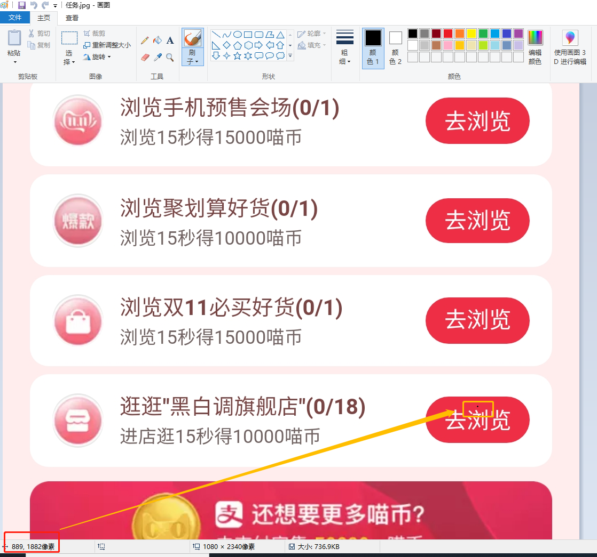

# 天猫双十一合伙人全民开喵铺
# 天猫双十一合伙人全民开喵铺
## 自动完成任务
### 注意事项
请使用天猫APP，且请保证网络通畅。<br>
无签到，结束之后请查看任务完成情况，每部手机效果都不一样，无法完全适配。<br>
如遇到天猫农场请手动完成。
### 版本
>>2019-09-02&nbsp;16:58:56 &nbsp;&nbsp; 天猫99聚划算节版本<br>
>>2019-10-22&nbsp;11:17:35 &nbsp;&nbsp; 双十一版本<br>
>>2019-10-30&nbsp;17:01:37 &nbsp;&nbsp; Sbwillbealier提供java版本&nbsp;xinxin8816 提供adb工具
### 使用说明
>>##### 1.安装python。(python版本需安装)
>>>[Win 10安装Python及环境变量配置](https://www.cnblogs.com/shizhijie/p/7768778.html)(传送门，此处不多介绍)
>>##### 2.手机连接电脑，打开开发者选项，并允许USB调试，允许模拟点击。
>>##### 3.打开手机天猫，进入开喵铺界面(不用打开任务列表)。运行此程序。
### 声明
>>此程序仅供技术交流，请勿使用于非法用途，任何人或组织无论以何种形式将其用在其他任何地方由此引发的各种问题均与本人无关。<br>
>>部分知识来源网络，如有侵权请联系删除。
### 其他
>>时长：15分钟左右
>>致谢各位提供的资源
### 测试环境
>>1.系统信息：window&nbsp;10<br>
>>2.手机系统：MIUI&nbsp;10
### 运行结果
```
===== 逛*****店(1/20) ======
进入店铺，浏览中，请等待 16 秒
===== 逛*****店(2/20) ======
进入店铺，浏览中，请等待 16 秒
===== 逛*****店(3/20) ======
进入店铺，浏览中，请等待 16 秒
===== 逛*****店(4/20) ======
进入店铺，浏览中，请等待 16 秒
===== 逛*****店(5/20) ======
进入店铺，浏览中，请等待 16 秒
===== 逛*****店(6/20) ======
进入店铺，浏览中，请等待 16 秒
===== 逛*****店(7/20) ======
进入店铺，浏览中，请等待 16 秒
===== 逛*****店(8/20) ======
进入店铺，浏览中，请等待 16 秒
===== 逛*****店(9/20) ======
进入店铺，浏览中，请等待 16 秒
===== 逛*****店(10/20) ======
进入店铺，浏览中，请等待 16 秒
===== 逛*****店(11/20) ======
进入店铺，浏览中，请等待 16 秒
===== 逛*****店(12/20) ======
进入店铺，浏览中，请等待 16 秒
===== 逛*****店(13/20) ======
进入店铺，浏览中，请等待 16 秒
===== 逛*****店(14/20) ======
进入店铺，浏览中，请等待 16 秒
===== 逛*****店(15/20) ======
进入店铺，浏览中，请等待 16 秒
===== 逛*****店(16/20) ======
进入店铺，浏览中，请等待 16 秒
===== 逛*****店(17/20) ======
进入店铺，浏览中，请等待 16 秒
===== 逛*****店(18/20) ======
进入店铺，浏览中，请等待 16 秒
===== 逛*****店(19/20) ======
进入店铺，浏览中，请等待 16 秒
===== 逛*****店(20/20) ======
进入店铺，浏览中，请等待 16 秒
已完成逛店任务
====== 浏览会场 ======
进入会场，浏览中，请等待 16 秒
进入会场，浏览中，请等待 16 秒
进入会场，浏览中，请等待 16 秒
已完成浏览会场任务
====== 浏览其他会场 ======
进入会场，浏览中，请等待 16 秒
进入会场，浏览中，请等待 16 秒
进入会场，浏览中，请等待 16 秒
====== 浏览会场 ======
进入会场，浏览中，请等待 16 秒
进入会场，浏览中，请等待 16 秒
已完成浏览会场任务
====== 浏览其他会场 ======
进入会场，浏览中，请等待 16 秒
进入会场，浏览中，请等待 16 秒
进入会场，浏览中，请等待 16 秒
全部任务已完成
请按任意键继续. . .

```
### 其他说明
>>1.测试手机为小米手机，分辨率为1920*1080，其他手机可能需要手动修改坐标。
>>2.请留意软件更新，如有能力者可以自行更改坐标，适配自己的手机。
>>3.一个任务20秒左右只为保证稳定，因为滑动后很久天猫才会开始计时。

### 坐标如何确定
>> 以2340*1080为例，打开淘宝活动页面，手机截图页面，使用电脑画图工具打开截图，确定每个按钮的位置<br>
>> 
